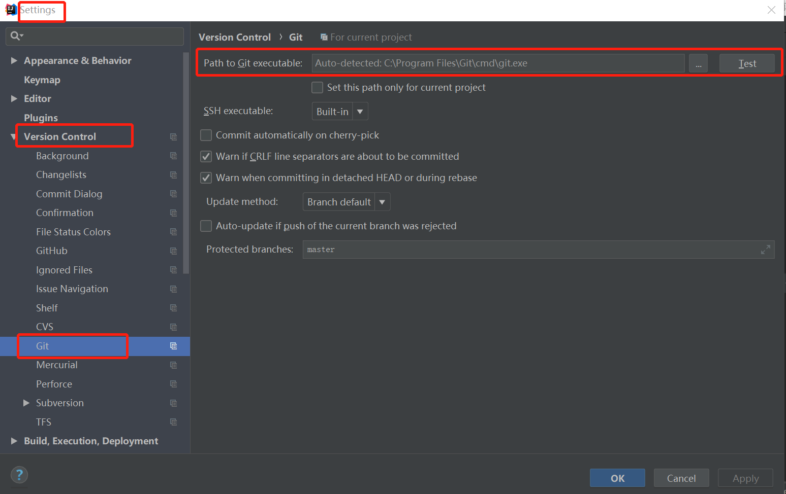
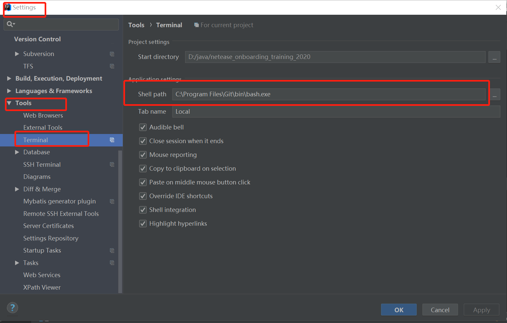

# IDEA使用过程中的一些技巧整理[keep updating]

## 1.在IDEA中使用Git

### 1.1在IDEA中使用git进行版本管理的配置



### 1.2在IDEA的控制台Terminal配置git bash


### 1.3初始化本地仓库

在Terminal键入如下代码：
```python
$ git init
```

一般的，我们会从clone一个远程repository开始初始化本地仓库，如下：
- create a repository in github


- clone the repository to local PC
```python
$ git clone git clone https://github.com/xxx/xxx.git
```
- bound the remote repository
```python
$ git remote add origin https://github.com/xxx/xxx.git
```
- use other command as you like：
```python
$ git status|git add .|git commit -m "msg"|git push origin master(:branch)
```

