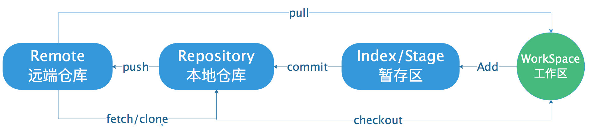

# git基础知识和基本指令

## 一.git基础知识

### 1.什么是git

git是一个开源的分布式版本控制系统，可以有效、高速地处理从很小到非常大的项目版本管理。

### 2.git的四个工作区域

- 工作区（workspace）
- 暂存区（index/stage）
- 本地仓库（local repository）
- 远端仓库（remote repository）




## 二.git基本指令

### 1.git基本指令的整理

```python
git init	# 在目录中创建新的 Git 仓库
git clone	# 拷贝一个 Git 仓库到本地
git status (-s)	# 查看上一次提交之后是否有修改，添加参数-s简短输出
git add file /git add .	# 将新建的文件或文件的改动添加或更新到缓存
git commit -m "msg"	# 缓存提交到本地仓库（可以跟一个说明文字msg）
git commit -am "msg"	# 使用参数-am，可以跳过add步骤，直接快捷提交
git reset --hard [hash的版本号]	# 强制回滚版本
git reset HEAD

# 后续更新和补充
```


