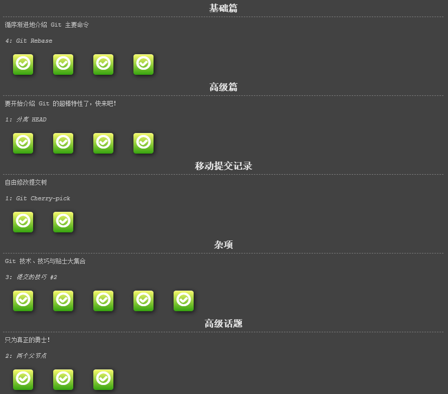
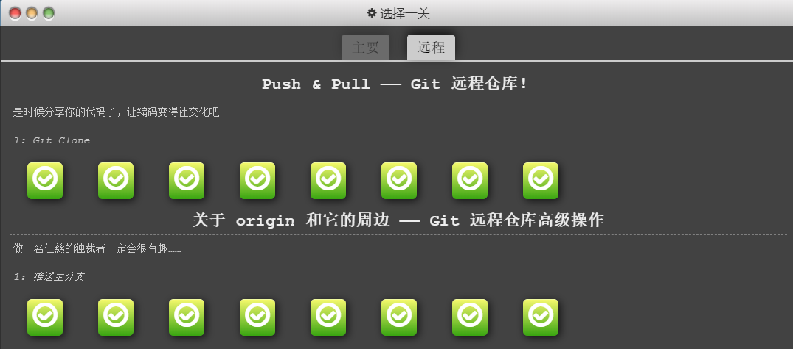

# git沙盒学习记录

## 学习网址

[https://learngitbranching.js.org/](https://learngitbranching.js.org/)

## 学习记录

### 1.第一部分：主要指令

#### 完成情况：



#### 指令整理

##### 1.1 基础篇

```python
git commit
git branch
git merge
git rebase
```

##### 1.2高级篇

```python
# 分离HEAD
# 相对引用(^)
# 相对引用(~)
# 撤销变更
```

##### 1.3移动提交记录

```python
git cherry-pick
git rebase -i
```

##### 1.4杂项

```python
# 只取一个提交记录
# 提交的技巧1
# 提交的技巧2
# git tag
# git describe
```

##### 1.5高级话题

```python
# 多次rebase
# 两个父节点
# 纠缠不清的分支
```

### 2.第二部分：远程指令

#### 完成情况



#### 指令整理

##### 1.基础

```python
git clone
# 远端分支
git fetch
git pull
# 模拟团队合作
git push
# 偏离的提交历史
# 锁定的master
```

##### 2.其他

```python
# 推送主分支
# 合并远程仓库
# 远程追踪
# git push的参数1
# git push的参数2
# git fetch的参数1
# 没有source的source
# git pull的参数
```

