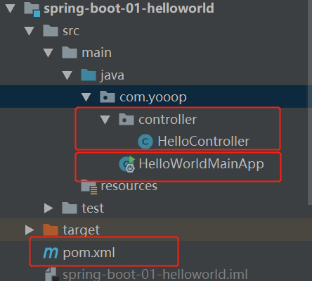

# springbot的知识点积累

## 1.关于springboot

简化Spring应用开发的一个框架，整个Spring技术栈的一个大整合，J2EE开发的一站式解决方案。


## 2.springboot项目的结构



可以看到，springboot的项目框架已经非常简单，controller包用于网络请求的处理，HelloWorldMainApp主函数使用标签@SpringBootApplication进行标注，是项目的启动类，pom.xml是maven项目的启动类。

## 3.springboot的pom.xml文件解读

### 3.1pom.xml首先有父项目

```xml
<parent>
    <groupId>org.springframework.boot</groupId>
    <artifactId>spring-boot-starter-parent</artifactId>
    <version>1.5.9.RELEASE</version>
</parent>
```

spring-boot-starter-parent的父项目为

```xml
<parent>
  <groupId>org.springframework.boot</groupId>
  <artifactId>spring-boot-dependencies</artifactId>
  <version>1.5.9.RELEASE</version>
  <relativePath>../../spring-boot-dependencies</relativePath>
</parent>
```

该项目用于springboot包的版本控制

### 3.2 启动器

```xml
<dependency>
    <groupId>org.springframework.boot</groupId>
    <artifactId>spring-boot-starter-web</artifactId>
</dependency>
```

spring-boot-starter：spring-boot场景启动器；帮我们导入了web模块正常运行所依赖的组件；

Spring Boot将所有的功能场景都抽取出来，做成一个个的starters（启动器），只需要在项目里面引入这些starter相关场景的所有依赖都会导入进来。要用什么功能就导入什么场景的启动器。

## 4.主程序类

```java
/**
 *  @SpringBootApplication 来标注一个主程序类，说明这是一个Spring Boot应用
 */
@SpringBootApplication
public class HelloWorldMainApplication {

    public static void main(String[] args) {

        // Spring应用启动起来
        SpringApplication.run(HelloWorldMainApplication.class,args);
    }
}
```

@**SpringBootApplication**:    Spring Boot应用标注在某个类上说明这个类是SpringBoot的主配置类，SpringBoot就应该运行这个类的main方法来启动SpringBoot应用；

## 5.配置文件

### 5.1 springboot的配置文件

- application.properties

- application.yml

作用：修改SpringBoot自动配置的默认值；SpringBoot在底层都给我们自动配置好

### 5.2 YAML语法

#### 基本语法

k:(空格)v：表示一对键值对（空格必须有）；

以**空格**的缩进来控制层级关系；只要是左对齐的一列数据，都是同一个层级的;

注意大小写敏感

#### 值的写法

字面量：普通的值（数字，字符串，布尔）

对象、Map（属性和值）（键值对）：

#### 数组（List、Set）：

用- 值表示数组中的一个元素

```yaml
pets:
 - cat
 - dog
 - pig
```

行内写法

```yaml
pets: [cat,dog,pig]
```
